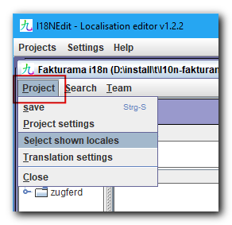
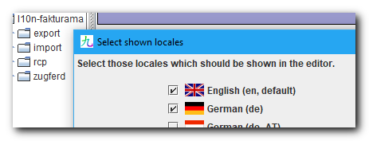
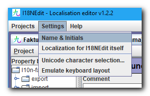
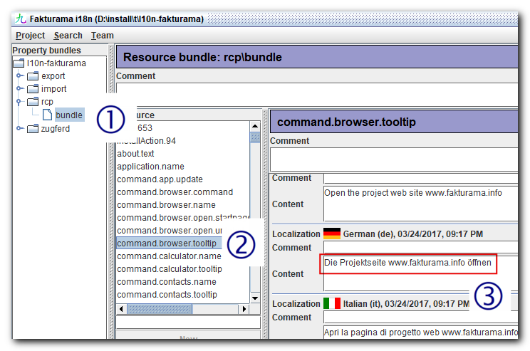

### Create or update the i18n files for Fakturama

There are some slight differences to the old Fakturama program.  The new utility program is named "i18nedit", a real old piece of software. But it works ;-) Now, to start immediately, I have prepared some things. You have to do the following steps:

* download [i18nedit](http://files.fakturama.info/dev/i18nedit.jar) from our homepage
* download and unzip the [Fakturama language files](http://files.fakturama.info/dev/current_i18n-fakturama.zip) into your working directory (note: these are all language files from all plugins)

The i18n files are from the following bundles:

* `com.sebulli.fakturama.rcp`
* `org.fakturama.export`
* `org.fakturama.import`
* `org.fakturama.exporter.zugferd`

The files are always located in the sub directory `OSGI-INF/l10n`.

Double click ``i18nedit.jar``, you can see an empty program window. Open a project (_Projects &rarr; open project&hellip;_) and select `i18nedit.properties` from your working directory. Via _Project &rarr; Select shown locales_ (please note the difference between the _Projects_ and the _Project_ menu entry, they reside on different menu bars!)

you can choose which languages you want to see:

Please set your name and initials:

If you want to change the localization of the i18nedit itself you can change it also via the _Settings_ menu.

Now the application window should look like this (the entries below _Ressource_ are only visible if you click on an entry in the left panel):

You have to click (1) to select the bundle which you want to translate. Then select (2) the entry and all translations for this entry appear. With the editor in (3) you can update the entry. If you want you can leave a comment above the entry. This comment is stored separately in a metaprops file.

You can step through the single entries and look if they can be used further or update them. Please, look at the English phrases and use them for the source of your translation. Don't forget to save your work regularly. If you have any question don't hesitate to contact [me](mailto:ralf.heydenreich@fakturama.info). 

You can find the [online documentation](http://files.fakturama.info/dev/i18nedit-help/onepagehtml) at our project web site or you can download a [pdf](http://files.fakturama.info/dev/I18NEdit.pdf). 

If you are ready with your work zip the whole working directory with all properties files and send it per [e-mail](mailto:ralf.heydenreich@fakturama.info) to me. Alternatively, I can create an account in our Git repository and you can commit your files directly.

Many thanks for your help. I'll include your name in the translators section in the _About box_.